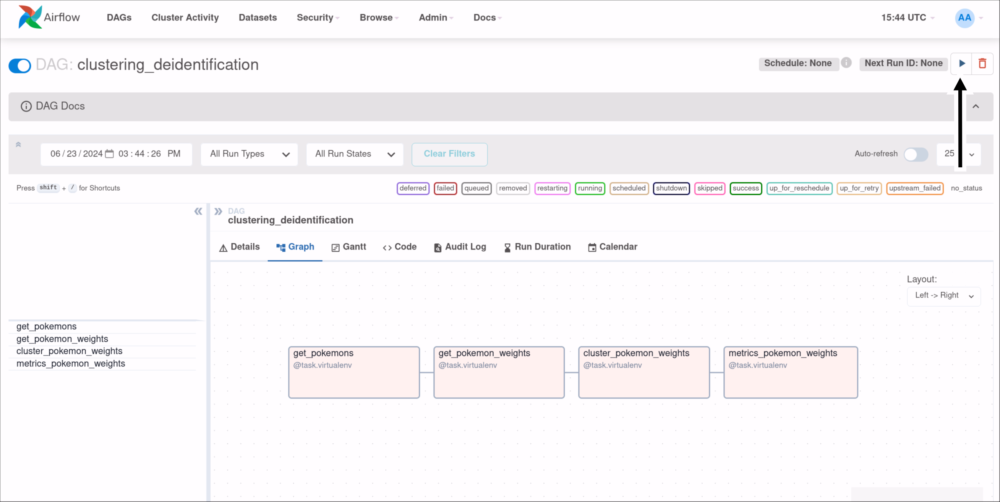
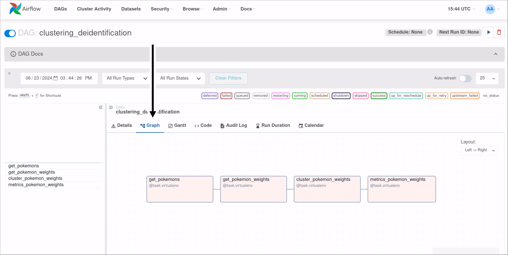
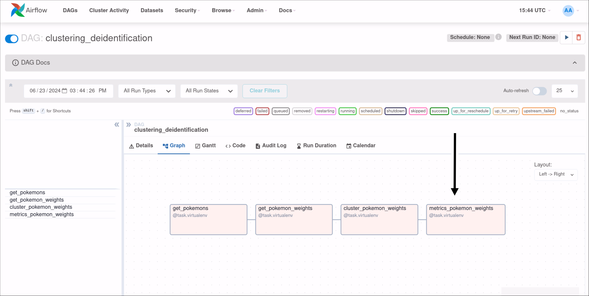
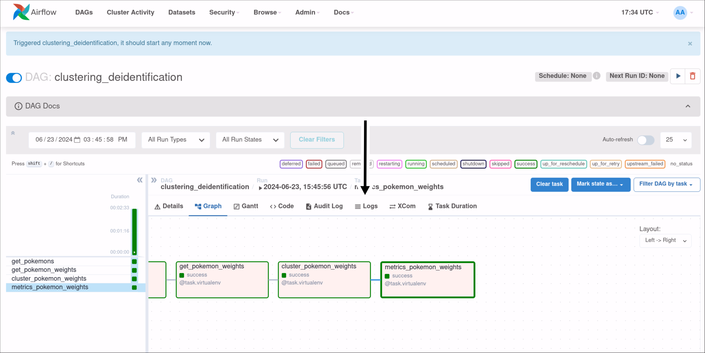
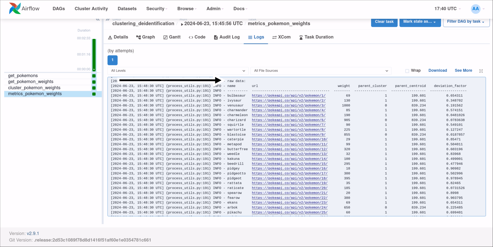
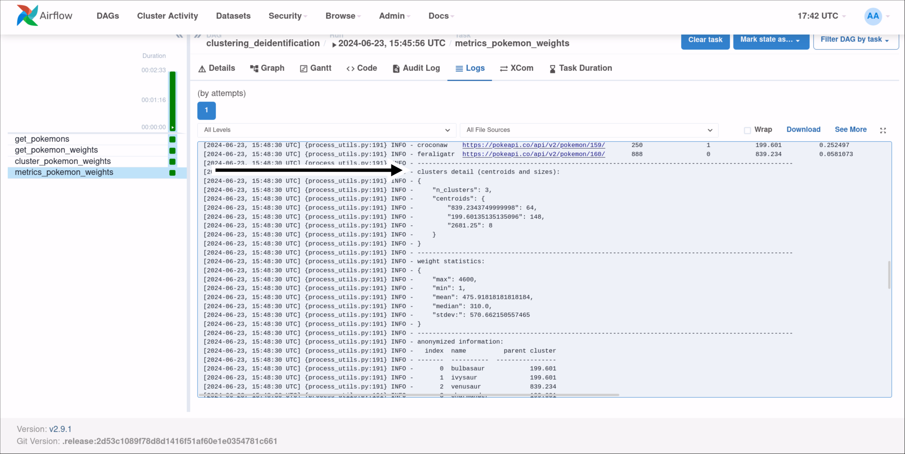
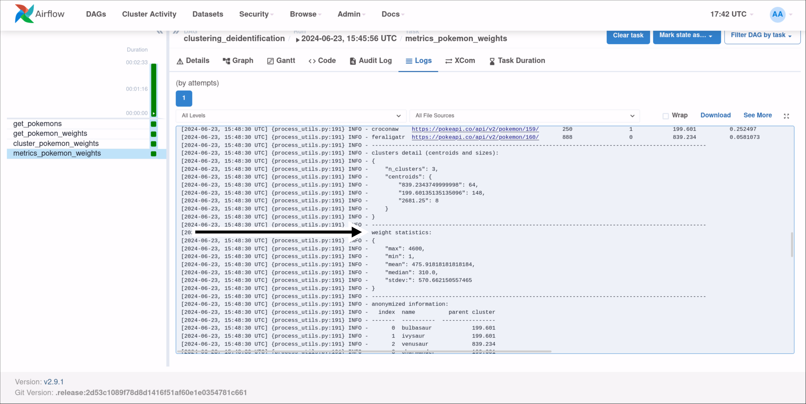
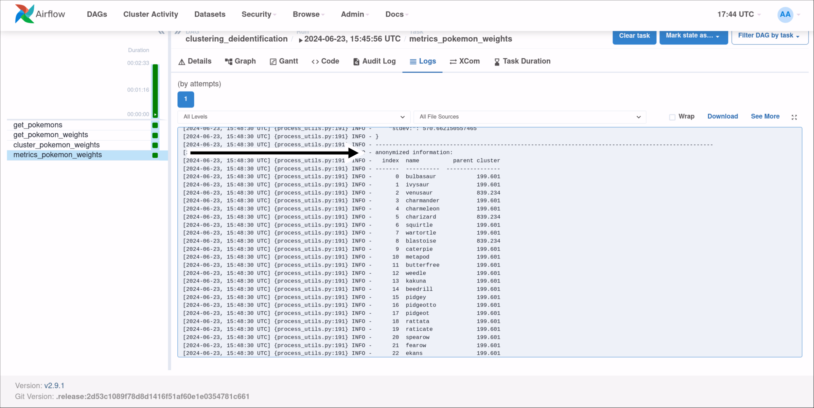

# Deidentification via Clustering using Airflow Taskflow API
This is an example of deidentifying data using a k-means clustering algorithm using the taskflow API in Airflow.
In this case, the data we will be deidentifying is the "weight" of the first 200-something pokemon. By using clustering, we will be able to tell what group each pokemon belongs to, without actually being able to see their weight. This allows for communicating information about their weights without diclosing what their weight actually was. 
We will alternatively further deidentify the data by giving just the centroids of the groups and their sizes in order to avoid disclosing the names of the pokemon.

Using Airflow to break out the tasks in the Python stages allows for not having to pull the data from the API multiple times and enables faster debugging.

## Setup

 - Install docker
 - Run "docker compose up"
 - Connect to "localhost:8080" in the browser
 - Sign in to portal with credentials "airflow:airflow"
 - Click on the "clustering_deidentification" DAG

## Walkthrough

To begin the DAG, select the "Trigger DAG" button in the top-right to trigger the DAG.

Select "Graph" to view the stages of the DAG.

Select the final task to highlight it.

Select the "Logs" tab to view the output.

The "Raw Data" is the raw information gathered about each pokemon, including the "sensitive" weight information. 
 - The "parent_cluster" column holds the index of the cluster it belongs to. 
 - The "parent_centroid" holds the weight value of the center of the group it belongs to. 
 - The "deviation_factor" column holds the error factor of its weight vs the group center. While not necessary, this is an interesting metric to have as it can be used to get an idea of how "unusual" this data point is.

The "Clusters Detail" is the three clusters (numbers specified at run time) and their respective sizes. This information deidentifies both the weights and the names of the pokemon in the list.

The "Weight Statistics" is just some statistics about the weights of the pokemon. In this case, there is a large difference between the mean and the median which means the data is not evenly distributed. 

The "Anonymized Information" is the information from the raw data minus the weight data.
