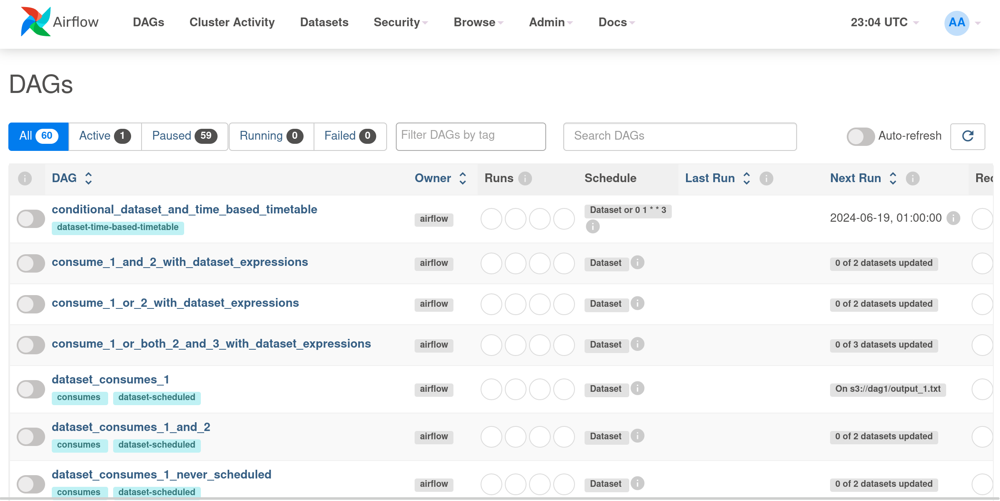
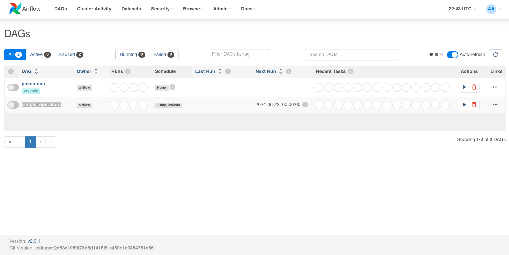
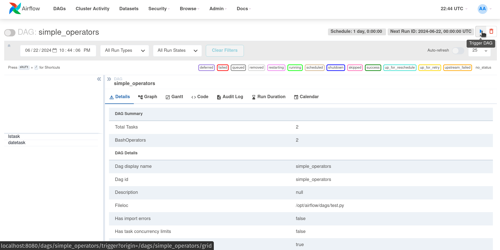
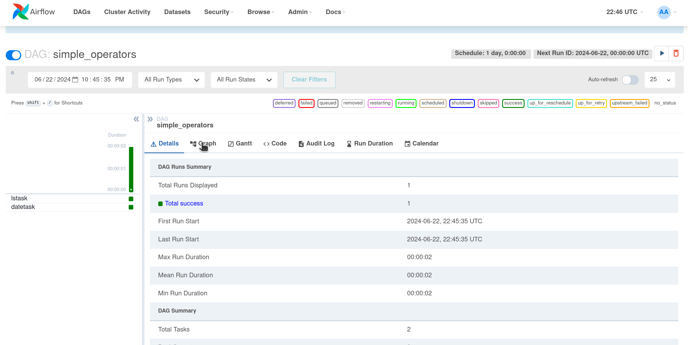
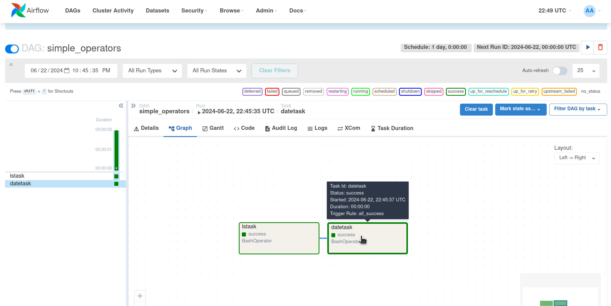
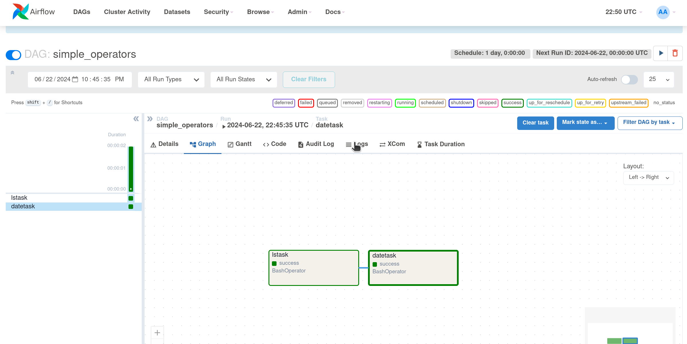

# Basic Airflow Demo

## Instructions

 - run "docker compose up"
 - connect to "localhost:8080" in the browser
 - sign in to portal with credentials "airflow:airflow"

## Usage

### 1. After login, will see something similar to this:

### 2. Select "Simple Operators"

### 3. Select "Trigger DAG"

### 4. Select "Graph" 

### 5. Select The Desired Task To View Logs 

### 6. Select The Logs Tab To View Output 

